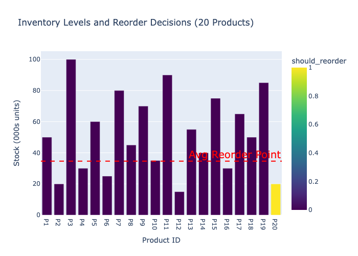
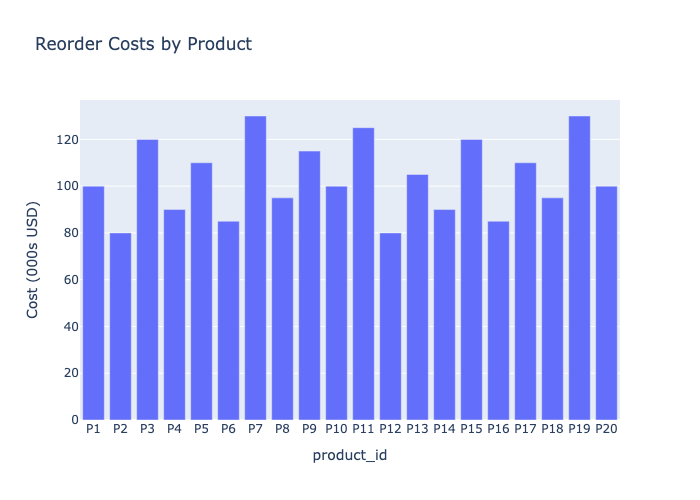

# Non Production
This is a non production sample using dashboards with Flask and other Python libraries

# Supply Chain Dashboard
A sample and simple Python-based tool to display a sample for Supply Chain, including admin logins, and other enhancements
1. Visualize inventory levels and optimize reorder points using `pandas`, `plotly`, and `pulp`.
2. Visualize the cost to reorder inventory per bulk and per unit
3. User needs to be logged in to view dashboard or reorder items

## Setup
1. Install: `pip install -r requirements.txt`
2. Run: `python supply_chain_dashboard.py`
3. Outputs: Dashboard based on input data (CSV) and writes it to `data/output/inventory_dashboard.csv`
4. Database for admin and regular user log ins with different visibility for each. For the sake of this sample the password for both will be password. The login will be admin and user respectively.

## Features
TODO Add Features points
- Reads inventory data from CSV, including product names, descriptions, purposes, and safety stock.
- Optimizes reorder decisions within a budget.
- Visualizes stock and reorder costs with interactive Plotly/Dash charts (names/descriptions in hover text).

## TODO
- TODO Login for admin and login for user
- TODO Enhancements to the dashboard
- Different dashboard views
- CSS updates

## Sample Output

